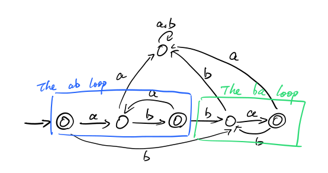

# COMP30026 2023 Practise Exam Answer

Hey. Just want to organize the answers, for anyone needing this in the future.

# Instructions

Please do not rely on the format. This is a community version, as there isn't a official one.


Correct means it has been verified by a tutor. You can click on the icon to jump to the source.


Verified means I have found someone with the same answer on [Ed](https://edstem.org/au/courses/12631/discussion/). Please note this **DOES NOT** mean absolutely correct. You can click on the icon to jump to the source.


Unchcked means I failed to find any asnwer on Ed, or it is an open-ended question, and I found my answer correct.

## Contribution

If you find anything wrong with it, even any typo, please do fire a PR, or change directly.


# Question 1

## Part A
### 1
[](https://edstem.org/au/courses/12631/discussion/1670387)

> $\psi =\lnot (\lnot P \lor Q) \lor R$
> 
> $\psi = (P \land \lnot Q) \lor R$
> 
> $\psi \models (\lnot Q\lor R)$
>
> $\rho = \lnot P \lor \lnot Q \lor R$
>
> $(\lnot Q \lor R) \models (\lnot P \lor \lnot Q \lor R)$
>
> I misunderstood the question at first, [it is asking for a single $\varphi$ that would satisfy all these conditions](https://edstem.org/au/courses/12631/discussion/1697140?comment=3786256).

$\varphi=(Q \to R)$

## Part B


> 1: $R \leftrightarrow S$
>
> 2: $\lnot(R\lor S)\to \lnot P$
>
> 3: $Q\to (R \oplus S)$
>
> 4: $(R\land S)\to Q$

```mathematica
In = LogicalExpand[Implies[Q, Xor[R, S]] && Implies[R && S, Q] && Equivalent[R, S] && Implies[! (R || S), ! P]]
Out = ! P && ! Q && ! R && ! S
```
Hence, by mathematica, and as [Bernhard Andersson pointed out](https://edstem.org/au/courses/12631/discussion/1696632?comment=3782543), *Macguffin cannot show films that week*.


# Question 2
[](https://edstem.org/au/courses/12631/discussion/1679710)

## Part A

> You need to give an interpretations that makes it valid and another that makes it unsatisfiable, [read more](https://edstem.org/au/courses/12631/discussion/1687211).

Consider $\mathcal{I}(D)=\mathbb{R}$, $\mathcal{I}(P)(x,y)=(x=y)$, $F\land G\equiv\top$.

Consider $\mathcal{I}(D)=\mathbb{R}$, $\mathcal{I}(P)(x,y)=(x\lt y)$, $F\land G\equiv\bot$.

<!---
For some reason, the "<" symbol won't render.
-->

Hence, $F\land G$ is satisfiable but not valid.

## Part B

> To show is not valid, only need to give a counter example.

Consider $\mathcal{I}(D)=\mathbb{R}$, $\mathcal{I}(P)(x,y)=(x\lt y)$, $F\lor G\equiv\bot$.

Hence, $F\lor G$ is not valid.

## Part C
[](https://edstem.org/au/courses/12631/discussion/1687211)

$H$ is valid, hence $G \models H$.


# Question 3

## Part A


> As Aimee Liang [pointed out](https://edstem.org/au/courses/12631/discussion/1696632?comment=3787623), it is more rigoros to use $F(z, x)$, which stands for $z$ is a friend of $x$, instad of $F(x, z)$.

$\forall x D(x)\land (\exists y P(y)\land E(x, y)) \to (\lnot \exists z C(z) \land F(z, x))$

## Part B
[](https://edstem.org/au/courses/12631/discussion/1682125)

> $\forall x \forall y \lnot (M(x)\land \forall z(\lnot D(z)\lor L(x, z)))\lor (\lnot M(y)\lor\lnot L(y, x))$
>
> I don't want to type anymore, I will list the outline, you can check Jordi Van Der Meer's step-by-step solution [here](https://edstem.org/au/courses/12631/discussion/1682125).
>
> Push $\lnot$ in
>
> replace $z$ by $f(x, y)$
>
> Distribute $\land$

$\{D(f(x, y)),\lnot M(x),\lnot M(y), \lnot L(y,x)\}$, 

$\{\lnot L(x, f(x, y)), \lnot M(x), \lnot M(y), \lnot L(y,x)\}$

> It means [Mice don't like mice who like dogs](https://edstem.org/au/courses/12631/discussion/1682357).


### Part C
[](https://edstem.org/au/courses/12631/discussion/1682125)

> *Harold likes himself*: $L(b,b)$
>
> Negate the formula: $\lnot L(b,b)$
>
> Note that $a$, $b$, $c$ are constants, and cannot be mapped.

<picture>
  <source media="(prefers-color-scheme: dark)" srcset="Media/Q3C_dark.svg">
  
</picture>

# Question 4

## Part A
[](https://edstem.org/au/courses/12631/discussion/1633024)

> The string is basically any number of `ab` followed by any number of `ba`.

- `abba`
- `bababa`
- `ababba`

## Part B
[](https://edstem.org/au/courses/12631/discussion/1696573)

<picture>
  <source media="(prefers-color-scheme: dark)" srcset="Media/Q4B_dark.svg">
  
</picture>

## Part C
[](https://edstem.org/au/courses/12631/discussion/1633024)

> Both lhs and rhs need to be able to match the string.

$a*\lor b*$


# Question 5

## Part A


State | a | b
--- | --- | --- 
S={1} | A | Z
A*={2,4,5} | B | C
B*={4,5} | B | D
C*={3,5} | Z | D
D*={5} | Z | D
Z={} | Z | Z

<picture>
  <source media="(prefers-color-scheme: dark)" srcset="Media/Q5Av2_dark.svg">
  
</picture>

## Part B
[](https://edstem.org/au/courses/12631/discussion/1685157)

`aa*b*`

## Part C


$(a\lor b)*$

# Question 6

## Part A
Please refer to [Jordi Van Der Meer's answer](https://edstem.org/au/courses/12631/discussion/1682610).

## Part B
[](https://edstem.org/au/courses/12631/discussion/1637053)

A string made up of 28 "a"s.

## Part C
[](https://edstem.org/au/courses/12631/discussion/1637053)

Please refer to Jordi Van Der Meer's answer:

$s\to \epsilon | a^4 | a^7 | a^8 | a^{11} | a^{12} | a^{14} | a^{15} | a^{16} | T a^{18}$

$T\to \epsilon | Ta$

# Question 7
[](https://edstem.org/au/courses/12631/discussion/1679807)

## part A

> Basically, just interchange $\forall$ with $exists$.
>
> Don't forget to interchange $\land$ with $\to$.

$\forall x (\forall y (y\in \mathcal{F} \to x\in y) \to \exists z (z \in \mathcal{G} \land x\ \in z))$

## Part B

Note that $\epsilon \in$ `(L\M)*`, but $\epsilon \not \in$`L*\M*`
<!---
I know this is not pretty, but `*` is not escaped correctly, there is nothing i can do about it.
-->

## Part C
`let L = {a, b}`

`Let M = {a}`

`L*\M* = {a, b}* \ {a}*`

`(L\M)* = {b}*`

`ab` is in `L*\M*`, but not in `(L\M)*`.


## Question 8


For alternative answer, please refer to [here](https://edstem.org/au/courses/12631/discussion/1680101).

## Part A
> I used Gauss's formula in this question, could be wrong tho. The tricky `0` cause is dealt by `length xs`, otherwise I needed to use `n+1`.
```haskell
import Data.List

isTotalFct :: Int -> [(Int,Int)] -> Bool
isTotalFct n xs = (sum $ nub $ map (\(x, _) -> x) xs) == (0 + n) * count `div` 2
    where count = length xs
```

## Part B
```haskell
import Data.List

isIdempotent :: Int -> [(Int,Int)] -> Bool
isIdempotent n xs = all (\(x, y) -> (elem (y, (apply y xs)) xs)) xs

-- Apply the function to a value.
--
-- Parameters:
--   $0: The input value
--   $1: The function
apply :: Int -> [(Int,Int)] -> Int
apply n ((x,y):xs) = if (n == x) then y else (apply n xs)
```

## Question 9
[](https://edstem.org/au/courses/12631/discussion/1680508)

> please note in the last operation, you can go `left` or `right`.
>
> Basically, you would go to the end of the string (first state), then move left 3 times to check if it is an `a`.
>
> If the string was not long enough, it would have been rejected when moving the pointer back (left).
>
> As [Bernhard Andersson said](https://edstem.org/au/courses/12631/discussion/1696632?comment=3783820), you need to consume the character (to `x`), in order to prevent the pointer from staying at the left most position instead of rejecting when the string is not long enough. (Yes, the Turing Machine [stays there](https://edstem.org/au/courses/12631/discussion/1695680) when you try to go left at the left most position.)

<picture>
  <source media="(prefers-color-scheme: dark)" srcset="Media/Q9v2_dark.svg">
  
</picture>

---
**Congrates on finishing the sample exam!**

# Change Log
- Nov 6,  9am, fixed Q1B, by [Bernhard Andersson](https://edstem.org/au/courses/12631/discussion/1696632?comment=3782543)
- Nov 6, 12am, fixed Q9,  by [Bernhard Andersson](https://edstem.org/au/courses/12631/discussion/1696632?comment=3783820)
- Nov 6,  9pm, fixed Q5A missing `b` loop in the graph, by [Aimee Liang](https://edstem.org/au/courses/12631/discussion/1696632?comment=3787836)
- Nov 6,  9pm, fixed Q3A, use $F(z, x)$ instead of $F(x, z)$, by [Aimee Liang](https://edstem.org/au/courses/12631/discussion/1696632?comment=3787623)
- Nov 7, 11pm, fixed Q4 typo, [the string is basically any number of ab followed by any number of **ba**.](../../issues/2)
- Nov 7, 11pm, fixed Q1A, [the question is asking for a single $\varphi$](../../issues/1)
